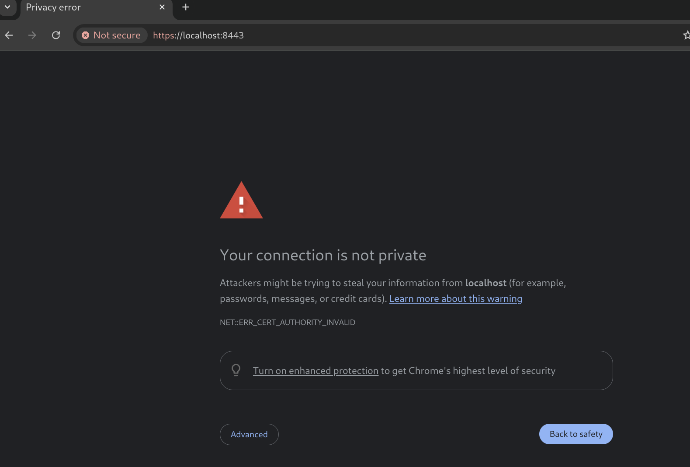
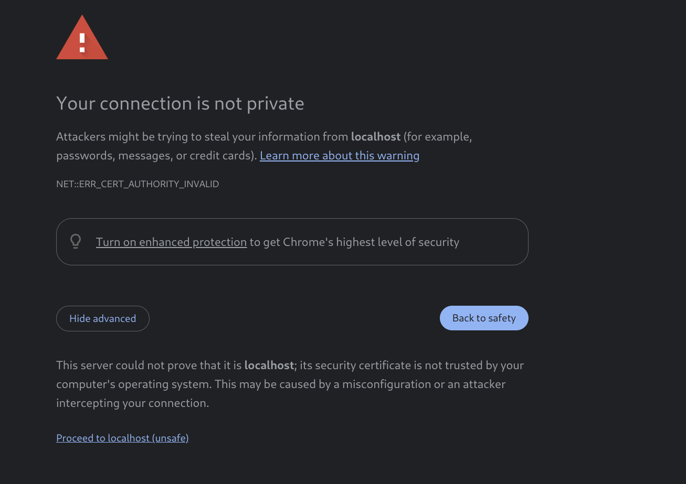
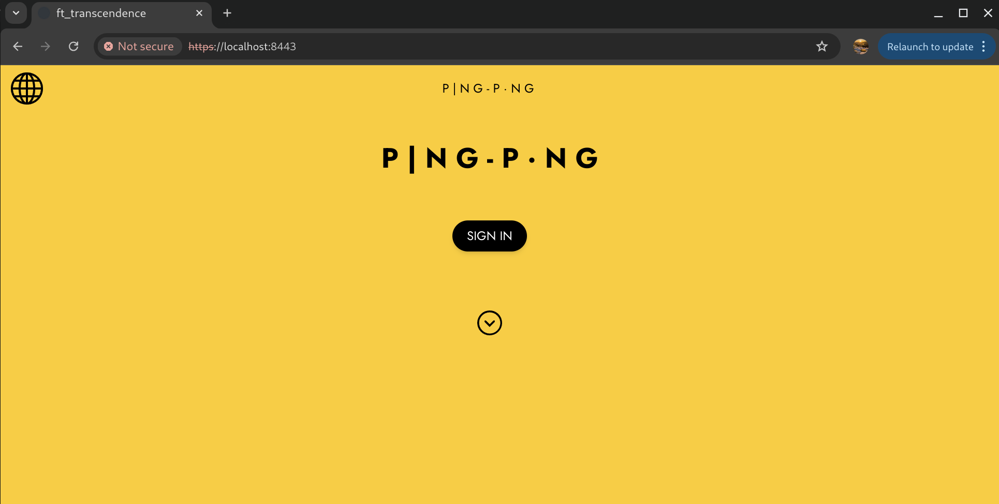

# FT_TRANCEDENCE
**ft_transcendence** is a **full-stack web application** and multiplayer gaming platform built as part of the 42 curriculum.<br>
The project combines real-time gameplay, user management, and tournament features while following a microservices architecture with secure authentication.<br>
Players can compete in a classic Pong game against friends, or random opponents, and managing their profiles.<br>

## Key Features

🎮 Real-time Pong Gameplay – Play against humans or AI opponents.<br>
🧑‍🤝‍🧑 User Management – Registration, login, and profile customization.<br>
🔐 Secure Authentication – JWT-based login and Two-Factor Authentication (2FA).<br>
🏆 Tournaments – Organize and participate in competitive tournaments.<br>
🌐 Multi-language Support – Accessibility for diverse users.<br>
🐳 Containerized Deployment – Fully managed with Docker Compose.<br>

## Tech Stack
**Frontend**
- React – Component-based UI
- TypeScript – Type-safe development
- Tailwind CSS – Utility-first styling

**Backend & Architecture**
- Node.js + Fastify – High-performance backend services
- Microservices Architecture – Modular design for scalability
- SQLite – Lightweight database for persistence
- Sequelize – ORM for structured and maintainable database management
- WebSockets – Real-time communication
- Docker & Docker Compose – Simplified deployment and isolation

## How to run
1. Clone the project
```sh
git clone https://github.com/Sherry5Wu/ft_trancedence.git ft_trancedence && cd ft_trancedence
```
2. Build the containers up
```sh
make
```
please be patient, this step may take around 2~3 minutes.<br>

3. After all the services(containers) are up, then you can access to the website: https://localhost:8443 <br>
Because the website uses a self-signed certificate, you will see the warning page shown below.<br>
Don’t worry — just click “Advanced”, then click “Proceed to localhost (unsafe)”.<br>
Note: I used Google Chrome, so if you are using a different browser, the wording may be slightly different.<br>





Now should see the frist page of our website:

